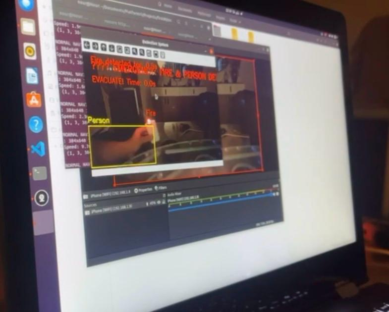
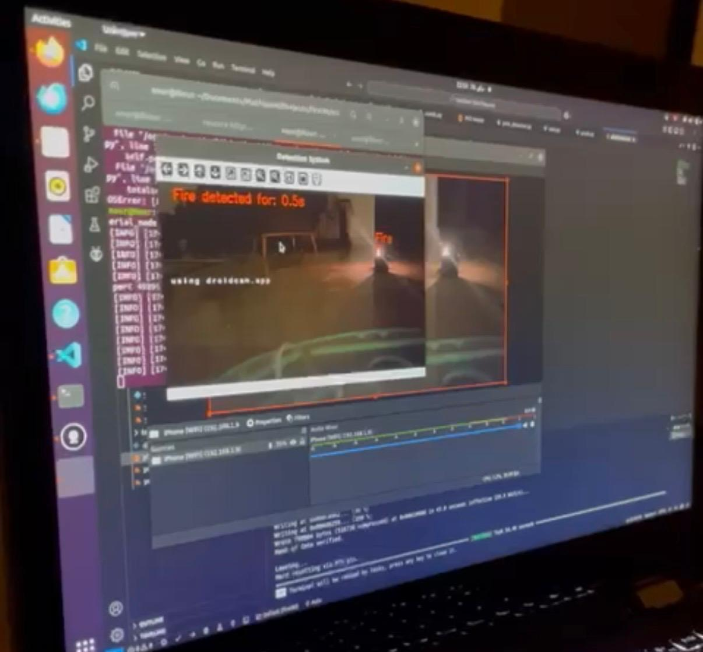
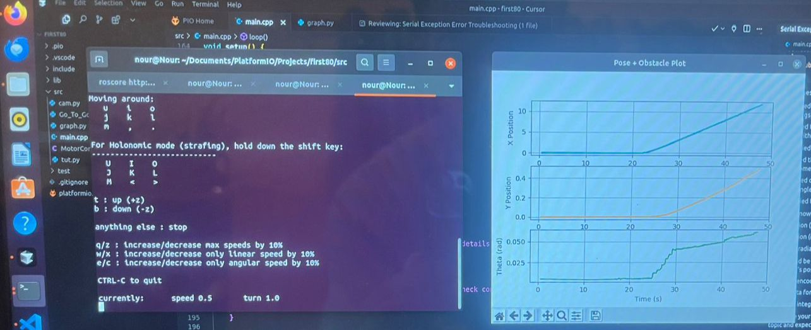

# ROS Autonomous Vehicle — Multi-Model Detection System

Real-time fire detection, person detection, and obstacle 
avoidance on a mobile robot with live web dashboard.

## What It Does

- Detects fire using custom-trained YOLOv8 model
- Detects people simultaneously using YOLO11
- Triggers emergency evacuation alarm when fire AND 
  person detected together (2-second confirmation 
  threshold prevents false alarms)
- Detects obstacles using YOLO11 with distance estimation
  (0.8m alert threshold)
- Streams live annotated video via Flask at port 5000
- ArUco marker obstacle detection with circular 
  avoidance maneuver
- Go-To-Goal navigation with PID velocity control
- Real-time pose visualization with matplotlib

## Demo

## System Flow

Camera (phone via DroidCam/IP Webcam)
    ↓
fire_person_detection.py
    ├── Fire model (custom YOLOv8)
    ├── Person + Obstacle model (YOLO11)
    ├── Emergency alarm logic (pygame)
    └── Flask server → live video at :5000
         ↓ ROS topics
Go_To_Goal.py — navigation controller
         ↓ cmd_vel
main.cpp (ESP32) — motors + BNO055 IMU + WiFi

## Tech Stack

- Python 3 + ROS Noetic (Ubuntu)
- YOLOv8 + YOLO11 (Ultralytics)
- OpenCV + Flask + Pygame
- ESP32 + BNO055 IMU + 4-wheel drive
- ArUco marker detection (aruco_obstacle_avoidance.py)
- matplotlib real-time pose plotting

## Hardware

- ESP32 microcontroller
- 4-wheel differential drive
- BNO055 9-DOF IMU
- Phone camera via DroidCam app
- Custom motor control board

## ROS Topics

| Topic | Type | Description |
|---|---|---|
| /obstacle_detected | Bool | True when obstacle within 0.8m |
| /obstacle_side | Float32 | Obstacle offset from center |
| /alarm_active | Bool | True when alarm triggered |
| /robot_pose | Pose2D | Position from ESP32 IMU |

## Setup

1. Install dependencies:
   pip install -r requirements.txt

2. Install ROS Noetic and source it:
   source /opt/ros/noetic/setup.bash

3. Add your fire detection model:
   Place best_fire_detection.pt in models/ folder
   Update in fire_person_detection.py:
   fire_model = YOLO("models/best_fire_detection.pt")

4. Configure camera in fire_person_detection.py:
   cap = cv2.VideoCapture(0)
   Or use DroidCam: cap = cv2.VideoCapture("http://your_phone_ip:4747/video")

5. Configure ESP32 in src/main.cpp:
   const char* ssid = "YOUR_WIFI_SSID";
   const char* password = "YOUR_WIFI_PASSWORD";
   Flash using Arduino IDE or PlatformIO.

6. Run:
   Terminal 1: roscore
   Terminal 2: python3 fire_person_detection.py
   Terminal 3: python3 Go_To_Goal.py
   
   Open http://localhost:5000 for live video stream

## Detection Logic

- Fire only → looping fire alarm until fire disappears
- Fire + Person together 2+ seconds → emergency alarm + EVACUATE message
- Obstacle under 0.8m → ArUco circular avoidance maneuver

## File Structure

- fire_person_detection.py — main detection + Flask server
- aruco_obstacle_avoidance.py — ArUco marker obstacle avoidance
- Go_To_Goal.py — PID navigation controller
- graph.py — real-time pose visualization
- src/main.cpp — ESP32 firmware
- src/MotorControl.h — motor control library

Built at Cairo University — Mechatronics Engineering 2026.
